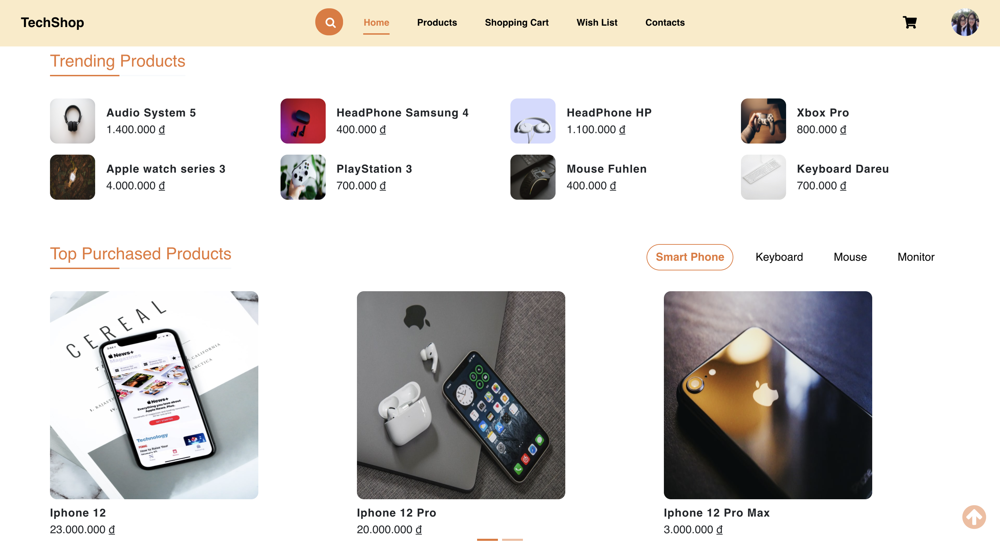
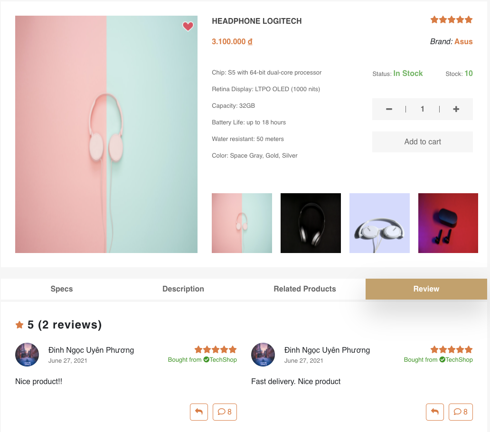
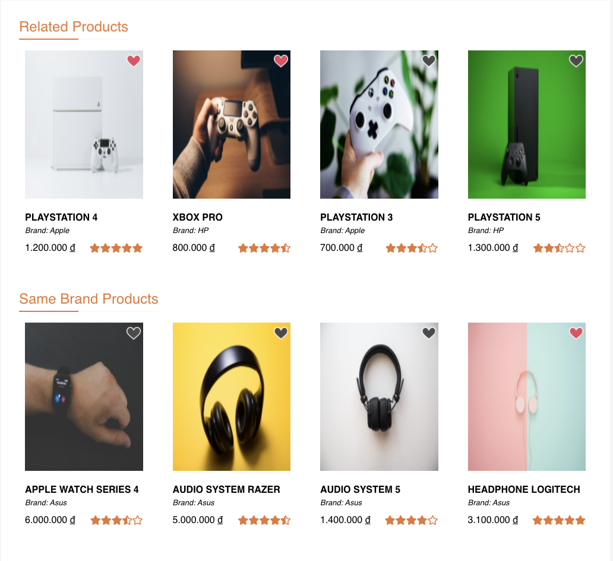
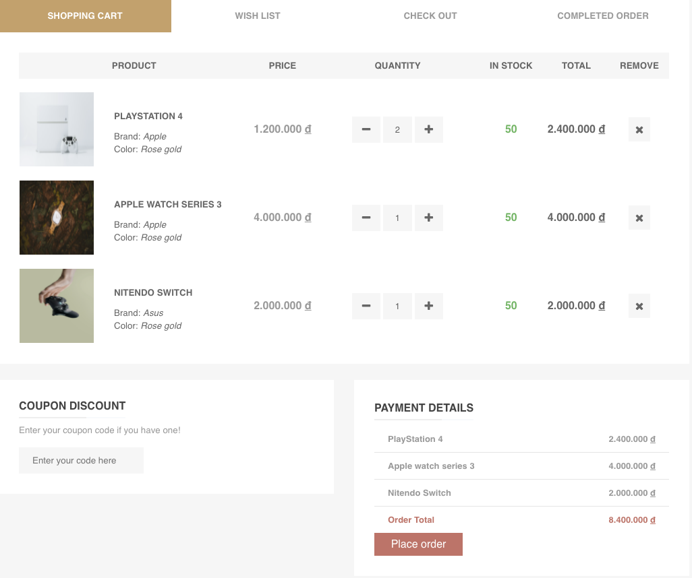
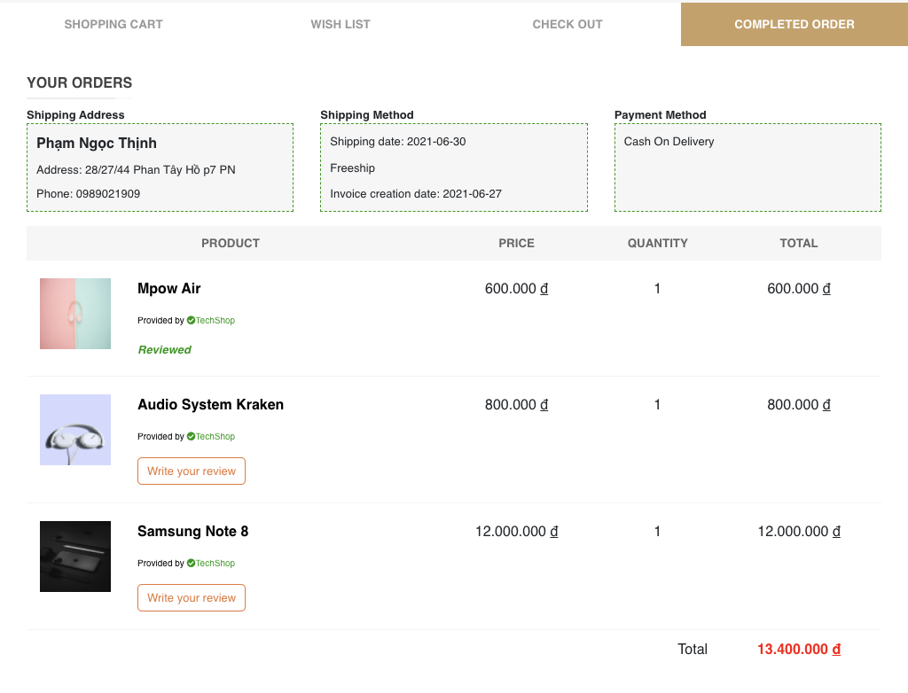

# TechShop

E-commerce app providing best tech products.

## `Our mission`

Serve consumers through online and focus on selection, price, and convenience.

## `Special functions`

- Track the status of your order.
- Cart and `buy online`.
- `Wishlist`.
- Leaving a `Review `on TechShop.
- Follow `trending` or `top purchased products`.
- Suggest `related products`.
- Update personal & shipping info.

## `Special Screenshots`

<i>Trending Products</i>

    

    <kbd>
    
    </kbd>
    

   
  
<i>Product Description</i>

    

    <kbd>
    
    </kbd>
    

   
  
<i>Related Products</i>

    

    <kbd>
    
    </kbd>
    

   
  
<i>Shopping Cart</i>

    

    <kbd>
    
    </kbd>
    

   
  
<i>Completed Order</i>

    

    <kbd>
    
    </kbd>
    

   

## `Libraries`

- [Redux Toolkit](https://redux-toolkit.js.org/)  
- [React Router](https://reactrouter.com/web/guides/quick-start) 
- [Boostrap 4](https://getbootstrap.com/docs/4.0/getting-started/introduction/) 
- [Redux Thunk](https://github.com/reduxjs/redux-thunk) 
- [ReactJS](https://reactjs.org/)

## `Tools:`

- Visual Studio Code
- Group facebook: discuss basic problems.
- Git: control versions of source code between local repository of each member and GitHub repository.
- GitHub: store source code of the whole project.
- Programming language: ReactJS.
- MySQL Server.
- Backend: [Java Spring Boot](https://github.com/ngocthinhboyy/TechShopBackend)

## `Contributors:`

- Dinh Ngoc Uyen Phuong - ID: 18520335 - email: 18520335@gm.uit.edu.vn
- Pham Ngoc Thinh - ID: 18520368 - email: 18520368@gm.uit.edu.vn
